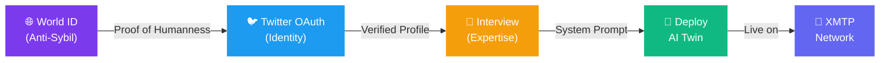
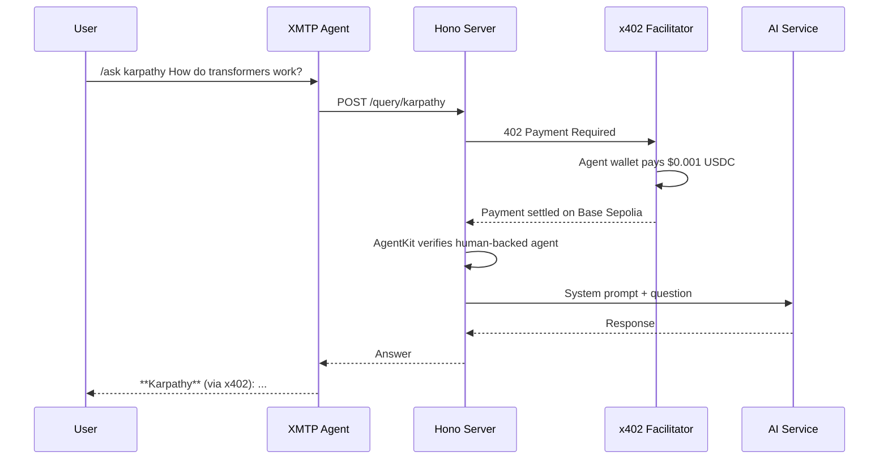
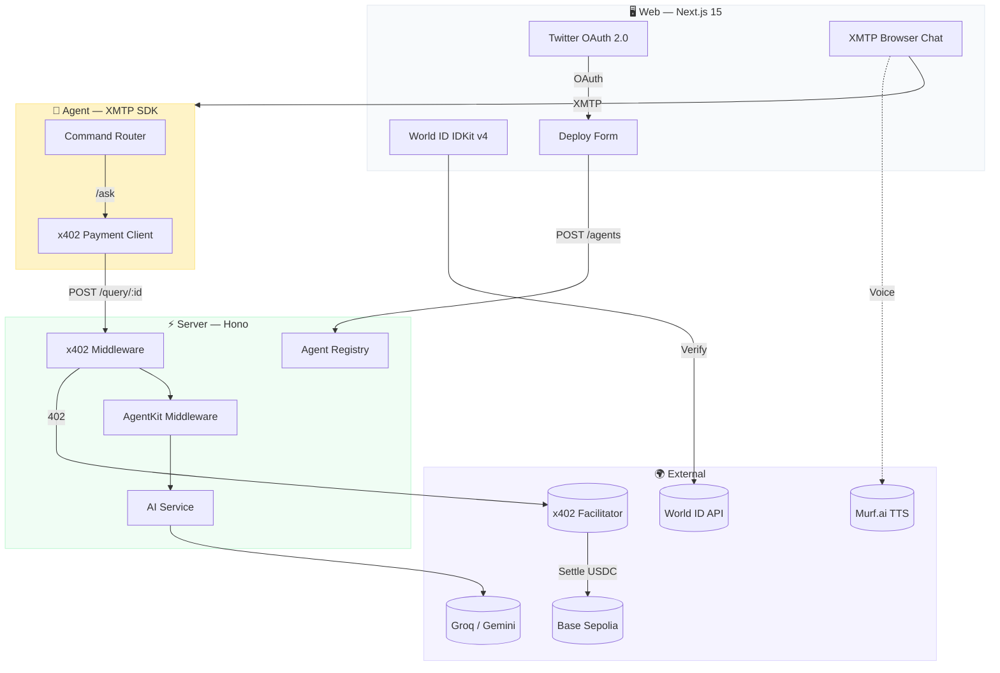
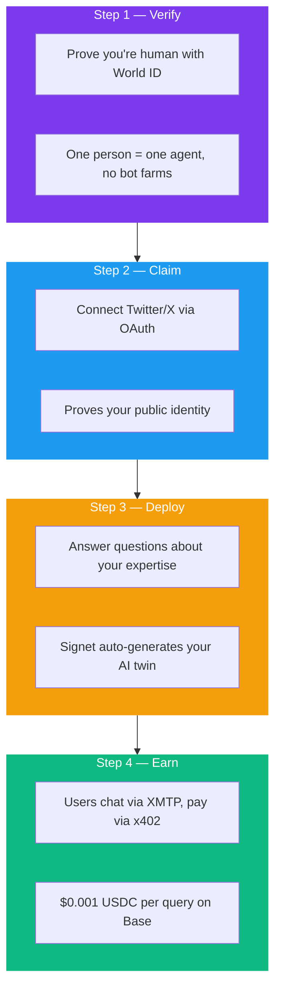

# Signet — AI Twins of Verified Experts

Prove you're human with World ID, claim your identity via Twitter, and deploy an AI twin that earns USDC for every query — all over XMTP, paid via x402.

## Architecture

### Creator Flow



### Query & Payment Flow



### System Architecture



### Project Structure

```
signet/
├── packages/shared/    # Types, agent configs, constants
├── server/             # Hono API — x402 payment wall + AgentKit verification
├── agent/              # XMTP bot — message routing, x402 payment client
└── web/                # Next.js — World ID + Twitter verification, agent marketplace
```

## Why Each Tech is Load-Bearing

| Tech | Role | Remove it and... |
|------|------|-----------------|
| **World ID** | Anti-sybil via IDKit. Proves every agent creator is a unique real human. | Marketplace flooded with spam bots and impersonators |
| **Twitter OAuth** | Identity claiming. Links your agent to your public Twitter profile. | No way to verify who the "expert" actually is |
| **x402** | Every query triggers a real USDC micropayment on Base Sepolia. Verifiable on-chain. | Agents can't earn, no economic model |
| **XMTP** | ALL agent interactions happen over XMTP. Chat IS the product. | No way to talk to agents |

## Verified On-Chain

Each `/ask` query triggers a real x402 payment:
- **Payer:** Agent wallet `0x3D04a2384f512bd49408618b16210cfc1e648569`
- **Receiver:** `0x863bDa0bDdd0B4Ae2Cd737448c310D3e161C9798`
- **Amount:** 1000 units ($0.001 USDC) per query
- **Chain:** Base Sepolia (eip155:84532)
- **Facilitator:** https://x402.org/facilitator

## How It Works



## XMTP Commands

```
/help               — Available commands
/list               — Browse agents
/ask <agent> <q>    — Query an agent
```

Example: `/ask karpathy How do transformers work?`

## Agents

| Agent | Domain | Price/Query |
|-------|--------|-------------|
| Andrej Karpathy (`karpathy`) | Data Science | $0.001 |
| Naval Ravikant (`naval`) | Finance & Investing | $0.001 |
| Paul Graham (`paulg`) | Marketing & Growth | $0.001 |
| Andrew Huberman (`huberman`) | Fitness & Nutrition | $0.001 |
| Patrick McKenzie (`patio11`) | Software Engineering | $0.001 |
| Preston Pysh (`prestonpysh`) | Finance & Investing | $0.001 |

Plus any user-deployed agents via the web interface.

## Setup

```bash
git clone https://github.com/KaranSinghBisht/signet.git
cd signet
cp .env.example .env   # fill in API keys
pnpm install

# Generate XMTP keys (if needed)
pnpm --filter agent gen:keys

# Run
pnpm dev:server        # Terminal 1: API server (port 3001)
pnpm dev:agent         # Terminal 2: XMTP agent
pnpm dev:web           # Terminal 3: Web frontend (port 3000)
```

## Tech Stack

| Layer | Technology |
|-------|-----------|
| Anti-Sybil | World ID (IDKit v4) |
| Identity | Twitter OAuth 2.0 (NextAuth) |
| Payments | Coinbase x402 (Base Sepolia, USDC) |
| Messaging | XMTP (agent-sdk v2.3) |
| Server | Hono + @worldcoin/agentkit |
| Frontend | Next.js 15 + Tailwind CSS |
| AI | Groq (Llama 3.3 70B) / Gemini |
| Voice | Murf.ai TTS (optional per agent) |
